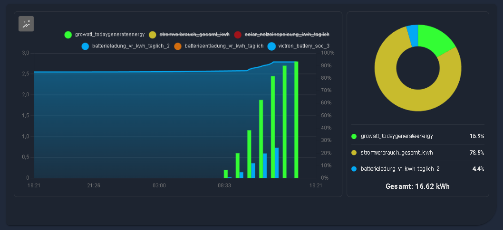

# Detailed Charts Panel
**Interaktive High-Performance Charts für Home Assistant – Deine Daten, endlich verständlich.**

Das 📉 **Detailed Charts Panel** ist eine leistungsstarke Visualisierungslösung für Home Assistant, um historische Daten deiner Sensoren tiefgehend zu analysieren. Es bietet Funktionen, die weit über die Standard-History hinausgehen.

Das Panel läuft vollständig lokal im Browser und nutzt die Websocket API von Home Assistant für maximale Performance.

## Features im Überblick

- **📉 Interaktive Charts:** Stufenloser Zoom & Pan (Touch & Mausrad) mit automatischem Nachladen der Daten (Infinite Scrolling).
- **⚡ Auto-Scale (W ➡ kW):** Rechnet Werte von `W`/`Wh` automatisch in `kW`/`kWh` um – kein Kopfrechnen mehr!
- **🍩 Donut Sidebar:** Optionale Seitenleiste für die prozentuale Verteilung (ideal für Stromverbrauch).
- **📊 Flexible Layouts:**
    - *Combined:* Alles in einem Chart.
    - *Grid:* 1 bis 4 Spalten nebeneinander.
    - *Mixed:* Übersicht oben, Details unten.
- **🔴 Thresholds:** Setze Warnlinien (z.B. bei 600W) als visuelle Referenz.
- **💾 Duales Speichern:** Speichere Ansichten lokal im Browser oder global in einer Datei.
- **📈 Live-Statistiken:** Min / Max / Durchschnitt / Summe / Aktuell – intelligent berechnet.
- **🏗️ Drag & Drop:** Ordne Charts im Grid-Modus einfach per Maus neu an.
- **🌑 Modern UI:** Voller Support für Home Assistant Themes (Light & Dark Mode).

Panel-View:

Card on Dashboard:

