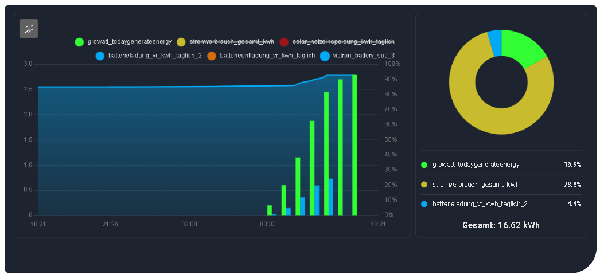
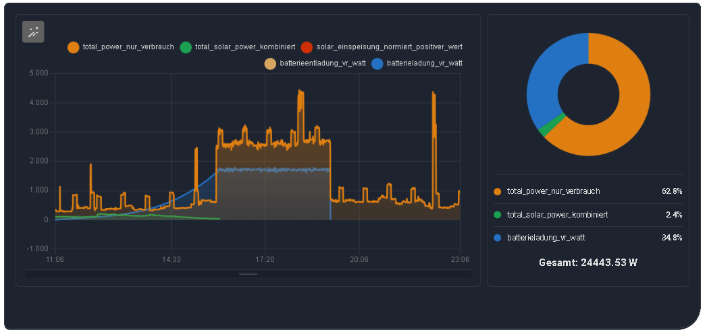

# Example Views

Here you see the different layout possibilities of the panel.

## 1. Combined View (Combined)
All sensors lie in one chart on top of each other. Ideal for recognizing mutual relationships (e.g., "When Solar rises, battery charge rises and power consumption falls.").

Combined View with enlarged chart for better overview

## 2. Separated View (Grid)
Each sensor has its own diagram. Perfect when units are very different (e.g., °C and Watt). The number of columns is adjustable.

## 3. Mixed View (Mixed)
The combination of both: Overview at the top, details at the bottom. Perfect for detailed views.

---

## Other View Examples

Shows kWh Energy of the last 7 days with Battery SoC displayed as a line in the background.

Example 2 shows temperatures of the last 24h with a reference line at 21 degrees for a quick overview.

Example 3 shows a Dashboard Card.

Example 4 also shows a Dashboard Card.

