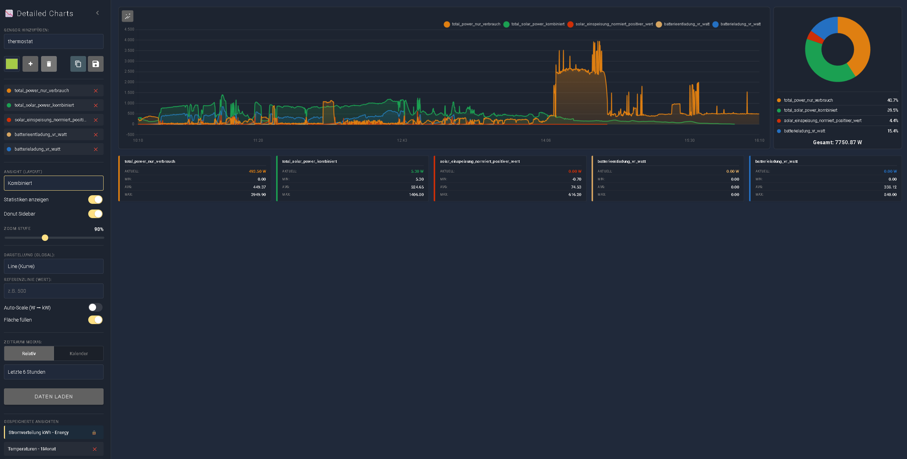
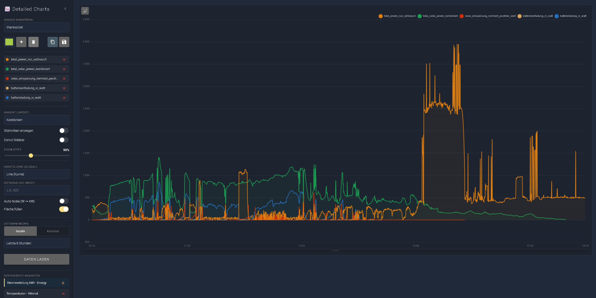
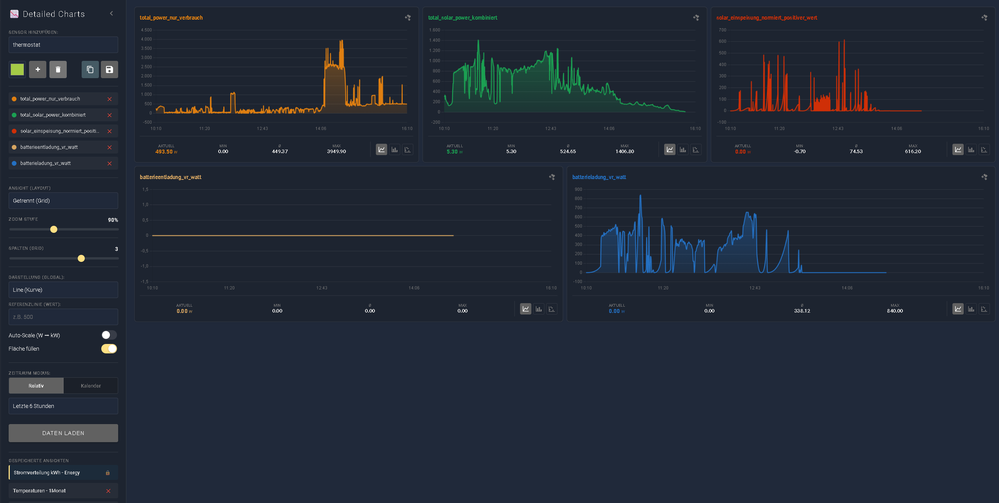
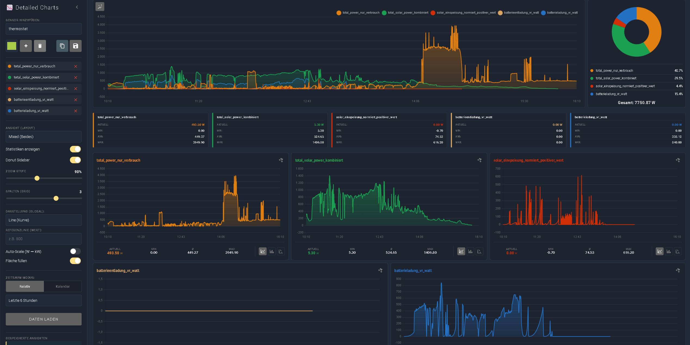
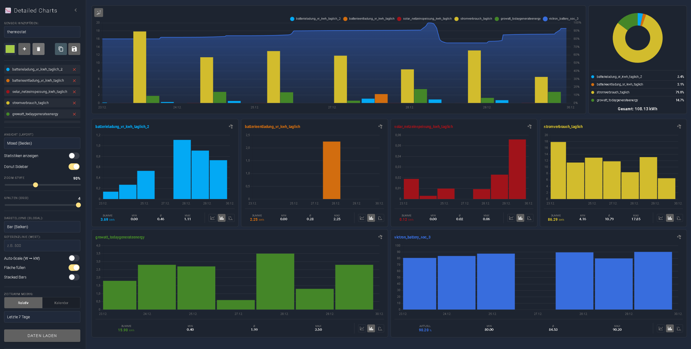
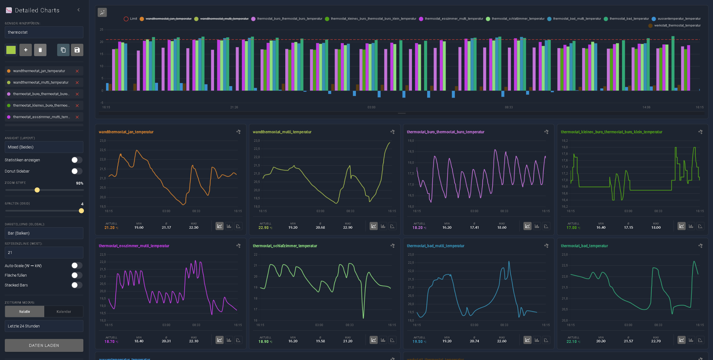

# Beispiel-Ansichten

Hier siehst du die verschiedenen Layout-Möglichkeiten des Panels.

## 1. Kombinierte Ansicht (Combined)
Alle Sensoren liegen in einem Chart übereinander. Ideal, um Korrelationen zu erkennen (z.B. "Wenn Solar steigt, steigt die Batterieladung").

## 2. Getrennte Ansicht (Grid)
Jeder Sensor hat sein eigenes Diagramm. Perfekt, wenn die Einheiten sehr unterschiedlich sind (z.B. °C und Watt). Die Spaltenanzahl ist einstellbar.

## 3. Mixed View
Die Kombination aus beidem: Oben die Übersicht, unten die Details.

---

## Andere View Beispiele

