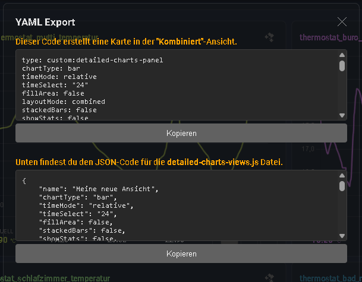

# Ansichten Speichern

Du kannst deine Konfigurationen im Panel Modus speichern, um sie später schnell wieder aufzurufen. Es gibt zwei Methoden:

## 1. Lokal (Browser Storage)
Klicke auf das **Speichern-Symbol** 💾 in der Sidebar.
* **Speicherort:** LocalStorage des Browsers.
* **Vorteil:** Schnell und einfach.
* **Nachteil:** Wenn du den Browser wechselst oder das Gerät wechselst, sind die Ansichten weg.

## 2. Global (JSON Export)
Das ist die "Profi-Methode", um Ansichten auf **allen Geräten** (Tablet, Handy, PC) verfügbar zu machen. Diese Ansichten erhalten ein **Schloss-Icon 🔒**.

### Vorgehensweise:

1.  Erstelle deine Wunsch-Ansicht im Panel.
2.  Klicke auf den **Kopieren-Button** (📋 Icon).
3.  Kopiere aus der Auswahl im Popup den unteren **JSON-Code**.
4.  Öffne die Datei `detailed-charts-views.js` in deinem Home Assistant Ordner (`/www/community/detailed-charts-panel/`).
5.  Füge den Code in das `sharedViews` Array ein.



### Beispiel für `detailed-charts-views.js`:

```javascript
export const sharedViews = [
    {
        "name": "Meine globale Solar-Analyse",
        "chartType": "bar",
        "sensors": [
             { "entityId": "sensor.solar_yield", "color": "#ff9800" }
        ],
        "timeMode": "relative",
        "timeSelect": "720", // Letzte 30 Tage
        "fillArea": true
    }
];
```
