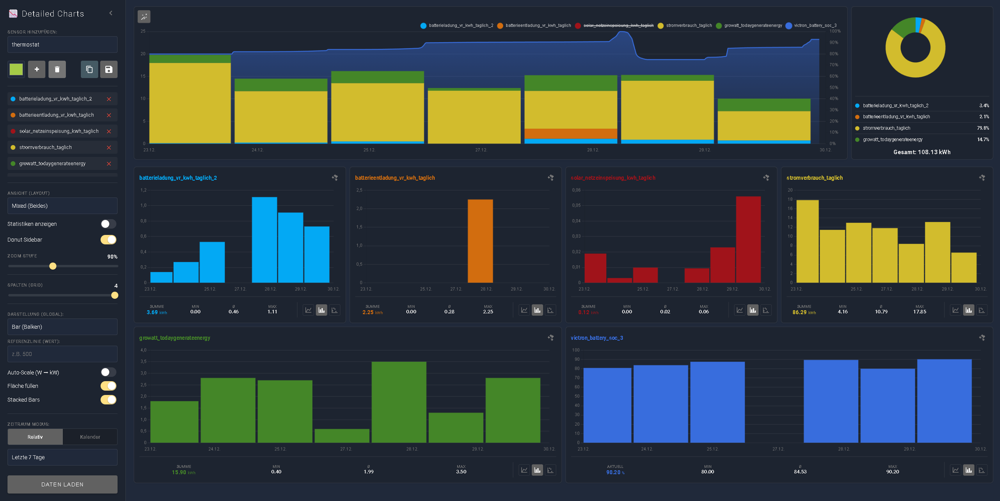

# Nutzung & Bedienung

## Schritt-für-Schritt Anleitung

Das Panel ist so konzipiert, dass du dich intuitiv von oben nach unten durch die Sidebar klickst:

1.  **Sensoren wählen:**
    * Tippe in das Suchfeld.
    * Wähle eine Farbe (optional).
    * Klicke auf `+`, um den Sensor hinzuzufügen.

2.  **Layout bestimmen:**
    * Wähle zwischen `Kombiniert`, `Getrennt (Grid)` oder `Mixed`.
    * Nutze im Grid-Modus den Slider, um die Spaltenanzahl (1-4) einzustellen.
    * Nutze den Zoom-Slider, um das komplette Panel in der Größe anzupassen.
	* Definiere weitere Voreinstellungen für das Layout.

3.  **Zeitraum festlegen:**
    * **Relativ:** (z.B. "Letzte 24h") für schnelle Checks.
    * **Kalender:** (Von/Bis) für exakte Analysen vergangener Ereignisse.

4.  **Chart-Typ verfeinern:**
    * Wähle global `Line`, `Bar`, `Scatter` oder `Stepped`.
	* Optional können eine Referenzlinie gesetzt oder die Fläche in Line Chart gefüllt werden usw.
    * *Tipp:* Im Grid und Mixed-Modus kannst du für jeden Sensor einzeln zwischen Line und Bar umschalten.
	* *Tipp:* Wenn du im Bar Chart View kwh Sensoren definiert hast und dann einen % Sensor wie (SoC Battery) hinzufügst, dann wird der Prozenztsensor als Line dargestellt.

---

## Panel Modus vs. Card Modus

Das Projekt ist dual konzipiert:

### 1. Panel Modus ("Editor" & "Labor")
Dies ist die Vollbild-Ansicht über die Seitenleiste (siehe Installation). Hier hast du alle Freiheiten: Suchen, Drag & Drop, Live-Analyse, Farben, Zeiten, usw. 
Dieser Modus ist dein "Labor", um Daten zu erforschen oder auch im "kombiniert" Modus eine Dashboard Card zu konfigurieren. Es dient aber vor allen Dingen der ausführlichen Analyse eurer Daten.

* Suchen & Finden: Durchsuche blitzschnell deine Sensoren.  
* Drag & Drop: Ordne Charts im Split-View einfach per Maus neu an.  
* Konfiguration: Stelle Zeiträume (relativ oder fester Kalender), Farben und Chart-Typen per UI ein.  
* Speichern: Ansichten speichern und später wieder aufrufen.



Im Panel-Modus könnt ihr zudem auch über den Kopieren Button eine Json Datei erstellen, diese in die `detail-charts-views.js` einfügen und somit die Ansicht auf allen Endgeräten verfügbar machen.

### 2. Card Modus ("Dashboard-Card")
Du hast im Panel Modus eine perfekte Ansicht erstellt und möchtest diese fest auf deinem Dashboard haben? 

1.  Konfiguriere deine Ansicht im Panel Mode.
2.  Klicke in der Sidebar auf den Button **Kopieren** (📋 Icon).
3.  Gehe zu deinem Dashboard, wähle "Karte hinzufügen" -> "details-chart-card".
4.  Füge den kopierten Code ein.

*Ergebnis:* Eine fest definierte Card, genau so konfiguriert, wie du sie im Panel Modus erstellt hast.  


Zweite Möglichkeit:

1. Konfiguriere deine Charts direkt in der Card im Dashboard.
2. Der Editor weißt die entsprechend Möglichkeiten an.  

*Ergebnis:* Eine custom Card, erstellt direkt im Dahsboard.


**Beispiel-Code**
Ein einfaches Beispiel für ein Linien Diagramm für die letzten 7 Tage:

```yml
type: custom:detailed-charts-panel
chartType: line
timeMode: relative
timeSelect: "168"
fillArea: true
layoutMode: combined
stackedBars: false
showStats: true
showDonutSidebar: false
zoomLevel: 0.9
autoScale: false
sensors:
  - entityId: sensor.gunstigster_benzinpreis
    color: "#59025f"
```

Oder hier mit **festgelegtem Zeitraum** ein Beispiel für ein Balken Diagramm für die letzten 24 Tage:

```yml
type: custom:detailed-charts-panel
chartType: bar
timeMode: fixed
dateStart: "2025-12-23T22:35"
dateEnd: "2025-12-24T23:35"
fillArea: false
layoutMode: combined
stackedBars: false
showStats: true
showDonutSidebar: false
zoomLevel: 0.9
autoScale: false
sensors:
  - entityId: sensor.gunstigster_benzinpreis
    color: "#59025f"
```

Dieses Beispiel hat einen **festen Start**, aber kein Ende und zeigt daher immer bis zum heutigen Tag die Werte an.

```yml
type: custom:detailed-charts-panel
chartType: bar
timeMode: fixed
dateStart: "2026-01-01 00:00:00"
fillArea: false
layoutMode: combined
stackedBars: false
showStats: true
showDonutSidebar: false
zoomLevel: 0.9
autoScale: false
sensors:
  - entityId: sensor.gunstigster_benzinpreis
    color: "#59025f"
```